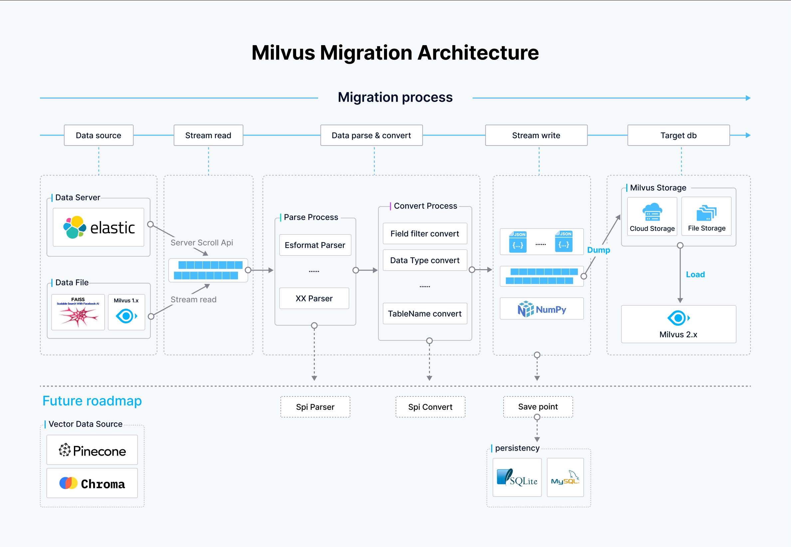

# Overview

Recognizing the diverse needs of user base, Milvus has expanded its migration tools to not only facilitate upgrades from earlier Milvus 1.x versions but also to enable seamless integration of data from other systems like [Elasticsearch](https://www.elastic.co/guide/en/elasticsearch/reference/current/elasticsearch-intro.html) and [Faiss](https://github.com/facebookresearch/faiss). The [Milvus-migration](https://github.com/zilliztech/milvus-migration) project is designed to bridge the gap between these varied data environments and the latest advancements in Milvus technology, ensuring you can harness improved features and performance seamlessly.

## Supported migrations

The [Milvus-migration](https://github.com/zilliztech/milvus-migration) tool supports a variety of migration paths to accommodate different user needs:

- [Elasticsearch to Milvus 2.x](es2m.md): Enabling users to migrate data from Elasticsearch environments to take advantage of Milvus's optimized vector search capabilities.
- [Faiss to Milvus 2.x](f2m.md): Providing experimental support for transferring data from Faiss, a popular library for efficient similarity search.
- [Milvus 1.x to Milvus 2.x](m2m.md): Ensuring data from earlier versions is transitioned smoothly to the latest framework.

## Features

Milvus-migration is designed with robust features to handle diverse migration scenarios:

- Multiple interaction methods: You can perform migrations via a command line interface or through a Restful API, with flexibility in how migrations are executed.
- Support for various file formats and cloud storage: The [Milvus-migration](https://github.com/zilliztech/milvus-migration) tool can handle data stored in local files as well as in cloud storage solutions such as S3, OSS, and GCP, ensuring broad compatibility.
- Data type handling: [Milvus-migration](https://github.com/zilliztech/milvus-migration) is capable of dealing with both vector data and scalar fields, making it a versatile choice for different data migration needs.

## Architecture

The architecture of [Milvus-migration](https://github.com/zilliztech/milvus-migration) is strategically designed to facilitate efficient data streaming, parsing, and writing processes, enabling robust migration capabilities across various data sources.

In the preceding figure:

- **Data source**: [Milvus-migration](https://github.com/zilliztech/milvus-migration) supports multiple data sources including Elasticsearch via the [scroll API](https://www.elastic.co/guide/en/elasticsearch/reference/current/scroll-api.html), local or cloud storage data files, and Milvus 1.x databases. These are accessed and read in a streamlined manner to initiate the migration process.
- **Stream pipeline**:
    - **Parse process**: Data from the sources is parsed according to its format. For example, for a data source from Elasticsearch, an Elasticsearch format parser is employed, while other formats use respective parsers. This step is crucial for transforming raw data into a structured format that can be further processed.
    - **Convert process**: Following parsing, data undergoes conversion where fields are filtered, data types are converted, and table names are adjusted according to the target Milvus 2.x schema. This ensures that the data conforms to the expected structure and types in Milvus.
- **Data writing and loading**:
    - **Write data**: The processed data is written into intermediate JSON or NumPy files, ready to be loaded into Milvus 2.x.
    - **Load data**: Data is finally loaded into Milvus 2.x using the [BulkInsert](https://milvus.io/api-reference/pymilvus/v2.4.x/ORM/utility/do_bulk_insert.md) operation, which efficiently writes large volumes of data into Milvus storage systems, either cloud-based or filestore.

## Future plans

The development team is committed to enhancing [Milvus-migration](https://github.com/zilliztech/milvus-migration) with features such as:

- **Support for more data sources**: Plans to extend support to additional databases and file systems, such as Pinecone, Chroma, Qdrant. If you need support for a specific data source, please submit your request through this [GitHub issue link](https://github.com/zilliztech/milvus-migration/issues).
- **Command simplification**: Efforts to streamline the command process for easier execution.
- **SPI parser** / **convert**: The architecture expects to include Service Provider Interface (SPI) tools for both parsing and converting. These tools allow for custom implementations that users can plug into the migration process to handle specific data formats or conversion rules.
- **Checkpoint resumption**: Enabling migrations to resume from the last checkpoint to enhance reliability and efficiency in case of interruptions. Save points will be created to ensure data integrity and are stored in databases such as SQLite or MySQL to track the progress of the migration process.